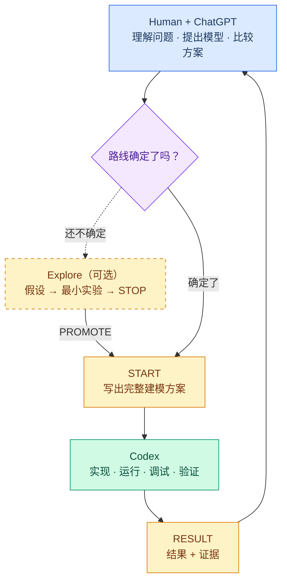

# KyMCM

> **You don't need a coder anymore in CUMCM.**

**把时间留给建模，把代码交给 Codex。**

KyMCM 是一个面向全国大学生数学建模竞赛（CUMCM）的 AI 协作工作流。

它把**建模思考**和**代码实现**分开：选手与 ChatGPT 专注于理解问题、提出模型、比较方案和判断证据；Codex 负责实现、运行、调试和计算。KyMCM 用一套轻量的 Markdown 工作流连接两者，让模型意图不会在交接中丢失，也让工程实现不会反过来绑架建模过程。

## Why KyMCM?

**Codex 已经会写代码了，但真正的瓶颈已经不再是 coding，而是 thinking 和 execution 之间的协作。**

- **少写无意义的代码。** 先低成本试错，只实现真正值得的方案。
- **别让代码绑架模型。** 建模始终保持在实现的上游。
- **别让模型死在交接里。** 让 ChatGPT 的建模意图和 Codex 的实际执行保持一致。

**KyMCM 补全了 creative modeling 和 AI execution 之间缺失的那一层。**

## How it works

KyMCM 的核心闭环只有三步：

1. **Explore** — 路线不确定时，先用最小实验验证想法，不写正式代码。
2. **START** — 把确定的建模方案写成一份结构化文档，完整交给 Codex。
3. **RESULT** — Codex 执行后返回结果和证据，人类审查、决策、继续。

> **整个闭环的关键不是自动化，而是分离**：建模思考留在人和 ChatGPT 手里，代码实现交给 Codex，START 和 RESULT 是两者之间不丢信息的接口。

## Quickstart

> 大多数 CUMCM 用户应从 **KyMCM Lite** 开始。

**安装：**

> Install KyMCM Lite skill from https://github.com/kyrie21z/KyMCM

**初始化工作区：**

> Initialize a contest workspace for 3 questions.

## License

MIT. See [LICENSE](LICENSE) and [NOTICE](NOTICE.md).

---

KyMCM 不是一键求解器，不生成论文，不替代数学判断。它是连接你的建模思考和 AI 执行之间的工作流。
